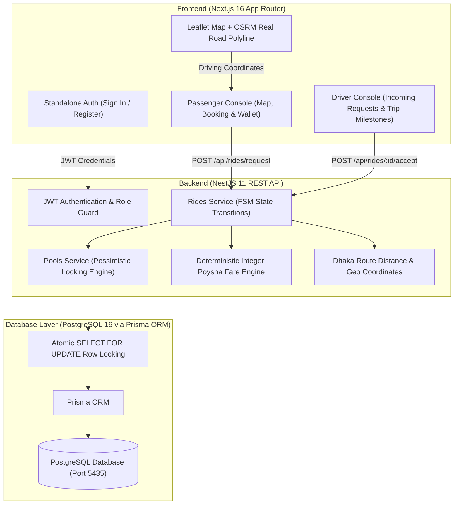

# 🚗 Dhaka Tesla Pool (TeslaShare)

> **Electric Vehicle Ride-Pooling & Fare-Splitting System Tailored for Dhaka's Traffic Corridors.**

---

## 📌 1. Project Overview & Problem Statement

In the dense morning traffic of Dhaka (8:41 AM at Banani Road 11), commuters like **Nusrat** (heading to Mohakhali) and **Rafiq** (heading to Gulshan 1) need fast, reliable transportation. **Jashim** drives **"Bullet"**, an electric 3-wheeler with a strict capacity of **3 passenger seats**.

**Dhaka Tesla Pool** connects passengers with overlapping routes into a single shared vehicle while guaranteeing:
1. **Bullet's physical capacity (3 seats) is NEVER exceeded**, protected against race conditions using PostgreSQL pessimistic row locking (`SELECT ... FOR UPDATE`).
2. **Every passenger receives their own distinct fare** calculated deterministically using integer Poysha ($1\text{ BDT} = 100\text{ Poysha}$) with a 30% pooling discount.
3. **Interactive Leaflet Map with Real Road Navigation**: Passengers can click directly on the map to set pickup and destination points or choose preset hubs. Routes follow real Dhaka roads via OSRM routing rather than straight lines.
4. **Driver Autonomy & Lifecycle Management**: Drivers view incoming ride requests, accept passengers, and control trip milestones (Driver Arrived ➔ Start Trip ➔ Complete Trip), with cashless TeslaPay wallet credit transferred automatically upon trip completion.
5. **Role-Based Authentication**: Clean standalone Sign In & Sign Up portal where user role automatically directs visitors to either the Passenger Console or Driver Console.

---

## 👥 2. The Story Cast & Seed Accounts

The platform comes pre-seeded with the PRD story cast (`backend/prisma/seed.ts`), while also allowing new passenger and driver accounts to register:

| Character | Role | Entity Details | Route & Operational Context |
| :--- | :--- | :--- | :--- |
| **Jashim** | **Driver** | **Tesla 3-Wheeler ("Bullet")** • Capacity: 3 Seats | Stationed at Banani Road 11; receives pool requests. Wallet starts at ৳0.00. |
| **Nusrat** | **Passenger 1** | TeslaPay Wallet: ৳1,500 (150,000 Poysha) | Books seat from Banani ➔ Mohakhali (2.6 km). |
| **Rafiq** | **Passenger 2** | TeslaPay Wallet: ৳1,200 (120,000 Poysha) | Books seat from Banani ➔ Gulshan 1 (2.8 km); compatible route with Nusrat. |
| **Shirin** | **Passenger 3** | TeslaPay Wallet: ৳1,000 (100,000 Poysha) | Commuter used in concurrency stress testing for the last remaining seat. |

> 🔑 **Default Password for All Seed Accounts**: `password123`  
> *Custom accounts can also be created directly via the Sign Up tab.*

---

## 🏗 3. System Architecture & Database Model

### Architecture Flow


### Database Schema (Prisma)
- **User**: `id`, `name`, `phone`, `email`, `passwordHash`, `role` (`PASSENGER` | `DRIVER` | `ADMIN`), `walletPoysha`.
- **Vehicle**: `id`, `name` ("Bullet"), `model`, `licensePlate`, `capacity` (3), `status` (`ONLINE` | `OFFLINE` | `BUSY`), `driverId`.
- **Pool**: `id`, `driverId`, `vehicleId`, `status` (`OPEN` | `FULL` | `IN_PROGRESS` | `COMPLETED` | `CANCELLED`), `totalSeats` (3), `availableSeats`, `pickupZone`.
- **RideRequest**: `id`, `passengerId`, `poolId`, `pickupZone`, `destinationZone`, `seatsRequested`, `isPooled`, `status` (`REQUESTED` | `MATCHED` | `DRIVER_ARRIVED` | `STARTED` | `COMPLETED` | `CANCELLED`), `estimatedFarePoysha`, `finalFarePoysha`.
- **PoolMember**: `id`, `poolId`, `rideRequestId`, `seats`, `farePoysha`.
- **WalletTransaction**: `id`, `userId`, `rideRequestId`, `amountPoysha`, `type` (`TOPUP` | `RIDE_PAYMENT` | `DRIVER_EARNING` | `REFUND`).

---

## 💰 4. Fare Engine & Deterministic Hand Calculation (PRD Section 5)

### Why Integer Poysha?
Floating-point decimals in JavaScript lead to rounding errors (e.g., `0.1 + 0.2 = 0.30000000000000004`). In financial systems, accumulating fraction-of-cent rounding errors breaks balance reconciliation. **All fares and wallet transactions are calculated and stored in integer Poysha ($1\text{ BDT} = 100\text{ Poysha}$).**

### Fare Formula
$$\text{PassengerFare} = \text{BaseFare} + \text{DistanceCharge} - \text{PoolDiscount}$$

- **Base Fare**: $3,000\text{ Poysha}$ ($৳30.00$)
- **Rate per Km**: $1,500\text{ Poysha/km}$ ($৳15.00/\text{km}$)
- **Pool Discount**: $30\%$ discount applied when sharing a pool.

### Step-by-Step Hand Calculation

#### 1. Nusrat's Trip (Banani ➔ Mohakhali, 2.6 km):
1. $\text{Base Fare} = 3,000\text{ Poysha}$ ($৳30.00$)
2. $\text{Distance Charge} = 2.6\text{ km} \times 1,500\text{ Poysha/km} = 3,900\text{ Poysha}$ ($৳39.00$)
3. $\text{Solo Fare} = 3,000 + 3,900 = 6,900\text{ Poysha}$ ($৳69.00$)
4. $\text{Pool Discount (30\%)} = 6,900 \times 0.30 = 2,070\text{ Poysha}$ ($৳20.70$)
5. **Nusrat's Final Pooled Fare** $= 6,900 - 2,070 = \mathbf{4,830\text{ Poysha}}\quad (\mathbf{৳48.30})$

#### 2. Rafiq's Trip (Banani ➔ Gulshan 1, 2.8 km):
1. $\text{Base Fare} = 3,000\text{ Poysha}$ ($৳30.00$)
2. $\text{Distance Charge} = 2.8\text{ km} \times 1,500\text{ Poysha/km} = 4,200\text{ Poysha}$ ($৳42.00$)
3. $\text{Solo Fare} = 3,000 + 4,200 = 7,200\text{ Poysha}$ ($৳72.00$)
4. $\text{Pool Discount (30\%)} = 7,200 \times 0.30 = 2,160\text{ Poysha}$ ($৳21.60$)
5. **Rafiq's Final Pooled Fare** $= 7,200 - 2,160 = \mathbf{5,040\text{ Poysha}}\quad (\mathbf{৳50.40})$

*Automated unit tests in `backend/src/fare/fare.service.spec.ts` verify these exact values.*

---

## ⚡ 5. Concurrency Control & Zero-Overbooking (PRD Section 12)

### The Problem
When Bullet has **1 seat remaining**, two passengers (e.g., Nusrat and Shirin) may attempt to book simultaneously. If both requests read `availableSeats = 1` before either writes, both would be confirmed, booking 4 passengers into a 3-seat vehicle.

### Our Solution
We implement **PostgreSQL Pessimistic Row Locking (`SELECT ... FOR UPDATE`)** inside a Prisma interactive transaction (`$transaction`):

```typescript
await this.prisma.$transaction(async (tx) => {
  // 1. Acquire an exclusive row-level lock on the pool
  const [pool] = await tx.$queryRaw<Pool[]>`
    SELECT * FROM pools WHERE id = ${poolId} FOR UPDATE
  `;

  // 2. Strict capacity check
  if (pool.availableSeats < requestedSeats) {
    throw new ConflictException("Bullet's capacity exceeded. Pool is full.");
  }

  // 3. Atomically decrement seats and update pool status
  await tx.pool.update({
    where: { id: poolId },
    data: {
      availableSeats: pool.availableSeats - requestedSeats,
      status: pool.availableSeats - requestedSeats === 0 ? PoolStatus.FULL : PoolStatus.OPEN,
    },
  });

  await tx.poolMember.create({ ... });
});
```

- **Result**: The first transaction acquires the lock, claims the seat, and sets `availableSeats = 0`. The second transaction waits for the lock, reads `availableSeats = 0`, and is cleanly rejected with `409 Conflict`.
- **Stress-Tested**: Verified in `backend/src/pools/concurrency-stress.spec.ts` using concurrent `Promise.allSettled()` requests.

---

## 🧭 6. Technology Choices & Justifications (PRD Section 7)

| Layer | Selection | Alternatives | Why It Fits This Ride-Pooling MVP |
| :--- | :--- | :--- | :--- |
| **Database** | **PostgreSQL 16** | MongoDB, MySQL, SQLite | Strong ACID transactions, relational foreign keys, and native row-level pessimistic locking (`FOR UPDATE`) ensure zero overbooking and financial integrity. |
| **ORM** | **Prisma ORM** | TypeORM, Drizzle | Type-safe queries, declarative schema definitions, and interactive transaction support with raw SQL locking escape hatches. |
| **Backend** | **NestJS 11** | Express, Fastify | Clean modular architecture with Dependency Injection, DTO validation pipes, and JWT guards out of the box. |
| **Frontend** | **Next.js 16 (App Router)** | Vite + React | Unified React framework with fast server rendering, route structure, and Tailwind integration. |
| **Mapping** | **Leaflet + OSRM** | Google Maps API | Open-source, no API keys or billing barriers required; provides real road-following navigation polylines across Dhaka streets. |
| **Styling** | **TailwindCSS 4** | CSS Modules | Fast, consistent UI styling with dark-mode aesthetic and zero runtime CSS overhead. |
| **Testing** | **Jest** | Vitest, Mocha | Built-in NestJS test runner with robust mocking and concurrency test execution. |

---

## 🤖 7. AI Usage Disclosure (PRD Section 8)

In accordance with PRD Section 8, AI assistance (Google DeepMind Antigravity IDE) was utilized during development:

1. **One Accepted Suggestion**:
   - **Suggestion**: Use **PostgreSQL pessimistic row locking (`SELECT ... FOR UPDATE`) within a Prisma interactive transaction** instead of an in-memory Node.js lock.
   - **Why Accepted**: In-memory locks only protect a single Node.js process. In a multi-worker or containerized setup, in-memory locks fail. Database row locks enforce safety at the single source of truth across all instances.

2. **One Rejected Suggestion**:
   - **Suggestion**: Use JavaScript floating-point numbers (`number`) for BDT currency (e.g., `48.30`).
   - **Why Rejected**: Floating-point math introduces IEEE 754 precision bugs in accounting. We strictly rejected this and enforced **integer Poysha ($1\text{ BDT} = 100\text{ Poysha}$)** across all database columns, backend services, and API responses.

---

## 🌐 8. High-Level Scaling Considerations (PRD Section 12)

If the platform scales to 100,000+ drivers across Greater Dhaka:
- **Spatial Indexing**: Replace simple coordinate calculations with **Uber H3 hexagonal spatial indexing** (Resolution 8/9, ~400m cells) for $O(1)$ driver proximity lookups.
- **Distributed In-Memory Locking**: Transition row-level database locks to **Redis Redlock / Lua scripts** for sub-millisecond atomic seat decrementing.
- **Event Streaming**: Use message queues (such as Kafka or RabbitMQ) to decouple trip requests, driver notifications, and asynchronous ledger writes.

---

## 🛠 9. Local Setup & Verification

### Prerequisites
- Node.js v18+ & npm
- Docker & Docker Compose

### Option A: Run via Docker Compose (One Command)
```bash
# Clone the repository
git clone https://github.com/rubayet36/TeslaShare.git
cd TeslaShare

# Build and start all services (Postgres, Backend with auto-migration/seed, Frontend)
docker compose up --build
```
- **Frontend App**: `http://localhost:3000`
- **Backend API**: `http://localhost:3001`
- **PostgreSQL Database**: `localhost:5435`

### Option B: Run Locally (Development Mode)
```bash
# 1. Start PostgreSQL
docker compose up -d postgres

# 2. Start Backend
cd backend
npm install
npx prisma db push
npm run seed
npm run start:dev

# 3. Start Frontend (in a separate terminal)
cd frontend
npm install
npm run dev
```

### Running Automated Tests
```bash
cd backend
npm test
```
*Runs all 34 Jest unit tests covering concurrency safety, fare engine, geography routing, and ride lifecycle transitions.*

---

## 📁 10. Repository Structure

```text
Dhaka Tesla Pool/
├── backend/
│   ├── prisma/
│   │   ├── schema.prisma            # PostgreSQL schema (Users, Vehicles, Pools, Rides, Wallets)
│   │   └── seed.ts                  # Seeds Jashim, Bullet, Nusrat, Rafiq, Shirin
│   ├── src/
│   │   ├── auth/                    # JWT authentication & registration
│   │   ├── fare/                    # Deterministic integer Poysha fare calculation
│   │   ├── geography/               # Dhaka landmarks, coordinates & OSRM road distance
│   │   ├── pools/                   # Pessimistic locking & pool management
│   │   ├── rides/                   # Ride lifecycle state machine
│   │   ├── users/                   # Commuter & driver profiles
│   │   └── wallet/                  # TeslaPay ledger transactions
│   ├── Dockerfile                   # Multi-stage production container with auto-seed
│   └── test/                        # Concurrency stress tests & unit tests
├── frontend/
│   ├── src/
│   │   ├── app/
│   │   │   ├── page.tsx             # Passenger booking console & map
│   │   │   └── driver/page.tsx      # Driver console & ride roster
│   │   ├── components/
│   │   │   ├── AuthStandaloneView.tsx # Standalone Sign In / Sign Up portal
│   │   │   └── DhakaMap.tsx         # Interactive Leaflet map with real road polyline
│   │   └── lib/api.ts               # Axios API client with JWT interceptor
│   └── Dockerfile                   # Frontend container
├── docker-compose.yml               # Multi-container orchestration (Postgres, API, Frontend)
└── README.md                        # Project documentation
```

---

*Dhaka Tesla Pool — Built for Dhaka's Roads.* 🇧🇩⚡
