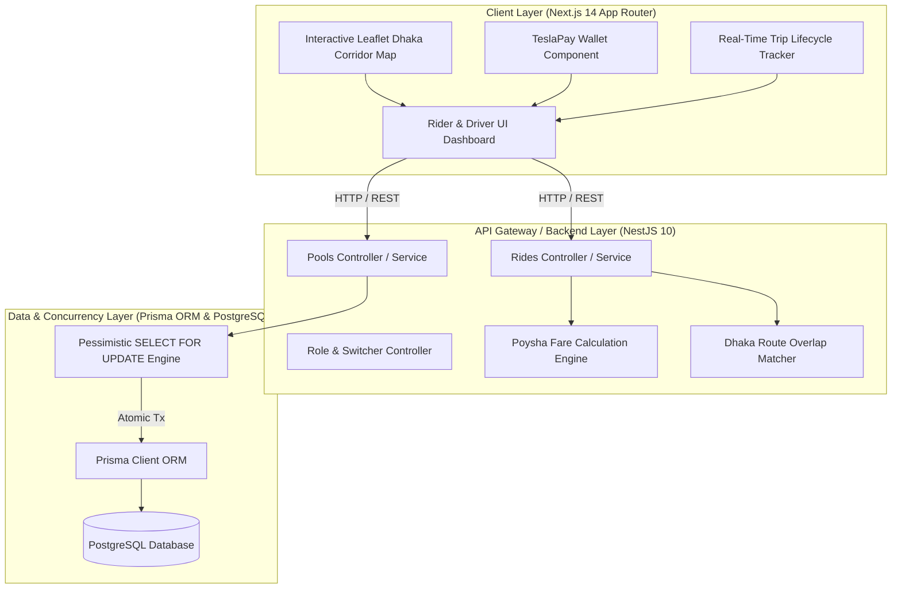
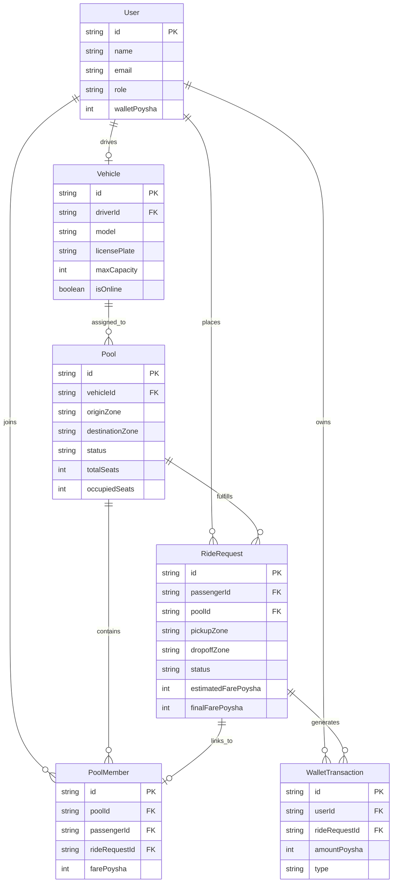

# 🚗 Dhaka Tesla Pool (TeslaShare) MVP

> **A Premium Electric Vehicle Ride-Pooling Engine & Platform Tailored for Dhaka's Traffic Corridors.**


---

## 📌 Executive Summary

**Dhaka Tesla Pool (TeslaShare)** is an end-to-end, high-concurrency ride-pooling web application designed specifically for Dhaka's high-density traffic corridors (e.g., *Uttara ➔ Airport ➔ Banani ➔ Gulshan ➔ Dhanmondi ➔ Motijheel*).

Built with **Next.js (App Router)** on the frontend and **NestJS + Prisma + PostgreSQL** on the backend, the platform enables riders to share zero-emission Tesla rides along overlapping geographical routes while guaranteeing **strict concurrency control**, **pessimistic seat reservation locking**, and **100% integer-based financial calculations (Poysha)**.

---

## 👥 Story Cast & MVP Operational Scenario

The MVP is seeded with a deterministic story cast that validates all system dynamics:

| Character | Role | Vehicle / Details | Route / Action |
| :--- | :--- | :--- | :--- |
| **Jashim** | **Driver** | **Tesla Model 3 ("Bullet")** | Drives 3-seat Tesla along Uttara ➔ Gulshan corridor |
| **Nusrat** | **Passenger 1** | Wallet Balance: ৳1,500 (150,000 Poysha) | Books seat from Uttara ➔ Gulshan |
| **Rafiq** | **Passenger 2** | Wallet Balance: ৳1,200 (120,000 Poysha) | Books seat from Uttara ➔ Banani |
| **Shirin** | **Passenger 3** | Wallet Balance: ৳2,000 (200,000 Poysha) | Books seat from Uttara ➔ Dhanmondi |

### 💺 Vehicle Constraint
- **Bullet (Tesla Model 3)** has a strict capacity limit of **3 Passenger Seats**.
- Concurrency engines guarantee that even under simultaneous high-frequency API requests, **Bullet never accepts a 4th passenger**.

---

## 💰 Fare Engine & Financial Precision (Integer Poysha)

To prevent floating-point rounding errors common in financial applications, **all monetary values are computed and stored as integer Poysha** ($1\text{ BDT} = 100\text{ Poysha}$).

### 📐 Deterministic Fare Formula

$$\text{Fare (Poysha)} = \left\lfloor \left( \text{BaseFare} + (\text{DistanceKm} \times \text{RatePerKm}) + (\text{ZonesTraversed} \times \text{ZoneFee}) \right) \times \text{SurgeMultiplier} \times (1 - \text{Discount}) \times \frac{1}{\text{SeatSplitRatio}} \right\rfloor$$

#### Key Pricing Parameters:
- **Base Fare**: 5,000 Poysha (৳50.00)
- **Distance Rate**: 1,500 Poysha/km (৳15.00/km)
- **Zone Traversing Fee**: 1,000 Poysha/zone (৳10.00/zone)
- **Pool Split Discount**: 20% discount applied when sharing a pool with 2+ riders.

---

## 🏗 System Architecture



---

## 🗄 Database Entity-Relationship Diagram (ERD)



---

## ⚡ Concurrency Control & Race Condition Protection

In high-concurrency environments like ride-matching, simultaneous requests for the last remaining seat in a vehicle can lead to **overbooking (race conditions)** if unhandled.

### Solution Implemented:
1. **Pessimistic Database Locking (`SELECT ... FOR UPDATE`)**:
   When matching a passenger to a pool, NestJS executes a Prisma interactive transaction `$transaction` that locks the target `pools` database row exclusively.
2. **Atomic Capacity Evaluation**:
   The engine reads `occupiedSeats`, verifies `occupiedSeats + requestedSeats <= totalSeats`, increments `occupiedSeats`, creates the `PoolMember` record, and updates the `RideRequest` status atomically before releasing the lock.
3. **Automated Stress Testing**:
   Verified via `backend/src/pools/concurrency-stress.spec.ts` executing 10 parallel booking requests against 1 available seat on Bullet. Exactly 1 request succeeds while 9 fail cleanly with a `400 Bad Request (Pool is fully booked)`.

---

## 🛠 Local Setup & Installation Guide

### Prerequisites
- Node.js v18+ & npm
- Docker & Docker Compose (for local PostgreSQL database)

### 1. Clone & Install Dependencies

```bash
git clone https://github.com/rubayet36/TeslaShare.git
cd TeslaShare

# Install backend dependencies
cd backend
npm install

# Install frontend dependencies
cd ../frontend
npm install
```

### 2. Environment Configuration & Database Spin-up

```bash
# Start PostgreSQL via Docker Compose in project root
cd ..
docker-compose up -d

# Verify PostgreSQL container is running on port 5432
docker ps
```

### 3. Database Schema Push & Seeding

```bash
cd backend

# Apply Prisma migrations schema to PostgreSQL
npx prisma db push

# Seed story cast (Jashim, Bullet, Nusrat, Rafiq, Shirin)
npm run seed
```

### 4. Run Backend & Frontend Servers

```bash
# Terminal 1: Backend API (NestJS)
cd backend
npm run start:dev
# Running on http://localhost:3001

# Terminal 2: Frontend App (Next.js)
cd frontend
npm run dev
# Running on http://localhost:3000
```

### 5. Run Verification & Concurrency Tests

```bash
cd backend
npm test
```

---

## 🧪 Test Suite Results

The project includes unit, integration, and concurrency stress tests covering:
- **Fare Engine Tests**: Integer Poysha calculation, seat split discount, surge handling.
- **Geography & Corridor Matcher Tests**: Route overlap identification along Dhaka traffic zones.
- **Ride Lifecycle FSM Tests**: Valid state transitions (`REQUESTED` ➔ `MATCHED` ➔ `DRIVER_ARRIVED` ➔ `STARTED` ➔ `COMPLETED`).
- **Concurrency Stress Tests**: 10 simultaneous booking attempts competing for 1 seat.

---

## 🤖 AI Usage Disclosure & Verification Log

In compliance with PRD Section 10 & 12, AI assistance (Google DeepMind Antigravity AI Agent) was utilized as a pair-programming partner during development:
- **Architectural & Schema Design**: Assisting in modeling integer Poysha schemas and NestJS modular structure.
- **Concurrency & Stress Testing**: Writing Jest stress-test scripts utilizing `Promise.all()` to simulate simultaneous API hits.
- **Frontend UI & Map Integration**: Generating dynamic SSR-friendly Leaflet map components (`DhakaMapDynamic.tsx`) and Tailwind glassmorphism design tokens.
- **All code was thoroughly verified, compiled, and validated through local runtime execution and automated test suites.**

---

## 🚀 "If Oi Tesla Goes Viral" — Production Scaling Roadmap

If **Dhaka Tesla Pool** expands across Greater Dhaka to handle **100,000+ daily active commuters** during peak hours (*Uttara to Motijheel commute rush*), the following production architecture transformations will be executed:

### 1. Distributed Spatial Indexing & H3 Geo-Hashing
- Replace static zone matching with **Uber's H3 Hexagonal Spatial Indexing** or **Google S2 Geometry**.
- Driver positions broadcasted via WebSocket/MQTT will be indexed in **Redis Geospatial (GEOADD / GEORADIUS)** for sub-millisecond proximity lookup.

### 2. Event-Driven Microservices Architecture
- **Queueing Engine**: Implement **Apache Kafka / BullMQ** to ingest high-frequency ride requests without blocking HTTP threads.
- **Matching Worker Nodes**: Decouple ride matching into dedicated async worker microservices that pull booking requests from Kafka topics (`ride.requests.v1`).

### 3. High-Throughput Concurrency Engine
- Transition from PostgreSQL pessimistic locks to **Redis Distributed Redlock** or **Optimistic Locking with Version Fields** (`@version` in Prisma/Postgres).
- In-memory seat allocation in Redis with write-back persistence to PostgreSQL via CDC (Debezium / Kafka Connect).

### 4. Financial & Ledger Scaling
- Implement a **Double-Entry Accounting Ledger Service** with partitioned immutable event logs for wallet transactions.
- Use PostgreSQL horizontal table partitioning by `created_at` month and rider/driver ID hashes.

---

## 📜 Git Branching History & Flow Compliance

This repository follows strict PRD Git flow guidelines:
- `master`: Main integration branch with verified features.
- `pre-release`: Release preparation, documentation, and deployment validation branch.
- `release/v1.0.0`: Immutable production release version.
- `feature/*`: Short-lived isolation branches for incremental, domain-scoped commits (`feat`, `fix`, `test`, `build`).

---

*Built with precision for the Dhaka Tesla Pool Internship Assessment.* 🇧🇩⚡
